# Strapi 行业门户解决方案

基于 Strapi v4 的行业门户网站解决方案，提供多个行业的网站模板，帮助企业快速构建专业的门户网站。

## 🎯 主要特点

- 基于 Strapi v4 开发
- 支持多个行业场景
- 模块化设计
- 易于扩展
- 完整的文档
- 开箱即用

## 📊 行业功能图表

### 企业门户功能分布
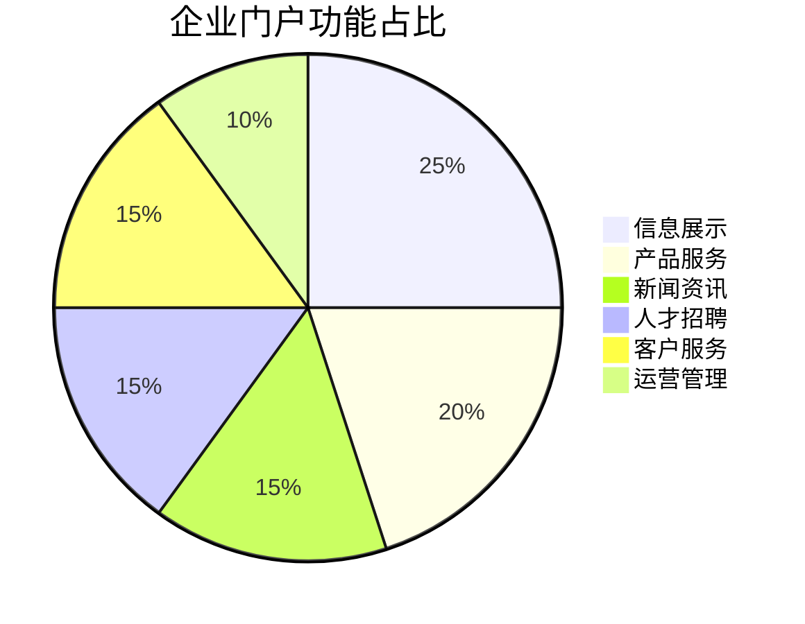

### 教育培训功能分布
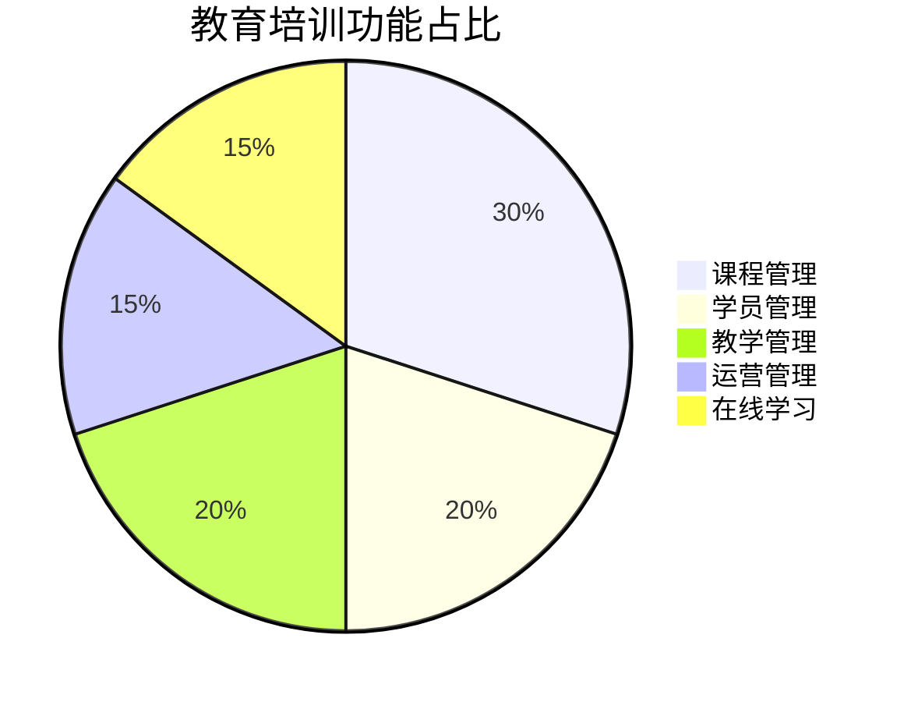

### 医疗健康功能分布


### 政府机构功能分布
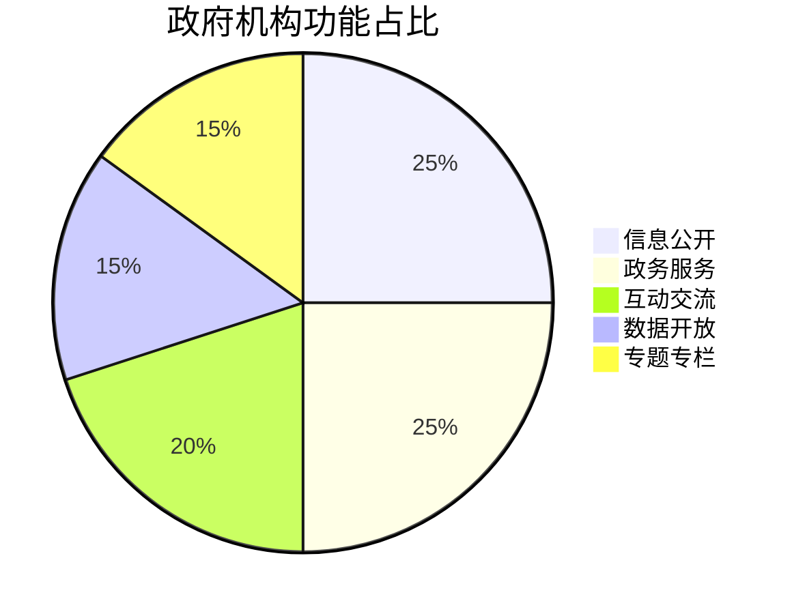

### 商贸服务功能分布
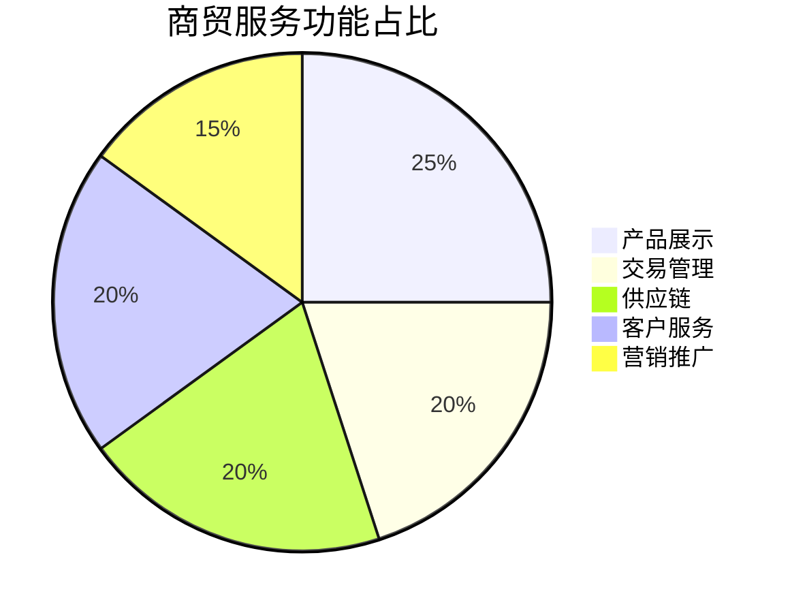

### 金融服务功能分布
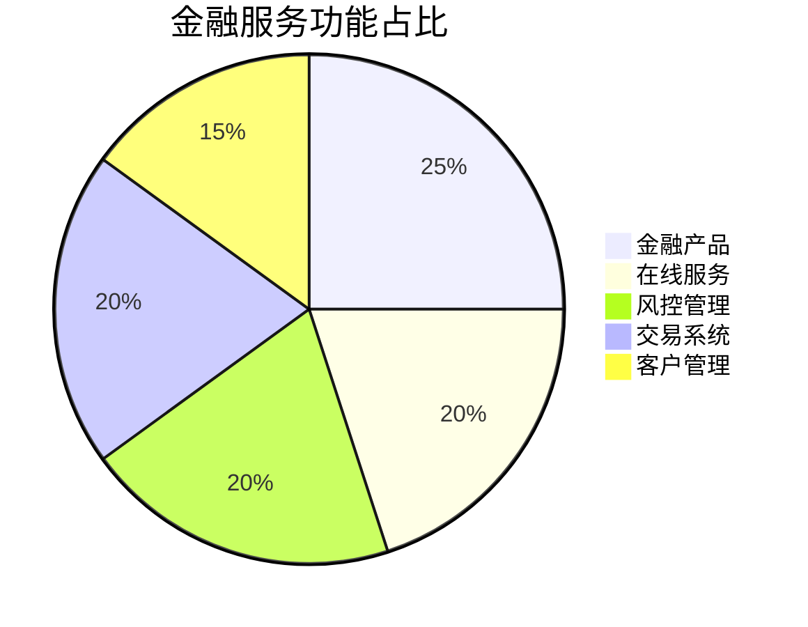

### 文化传媒功能分布
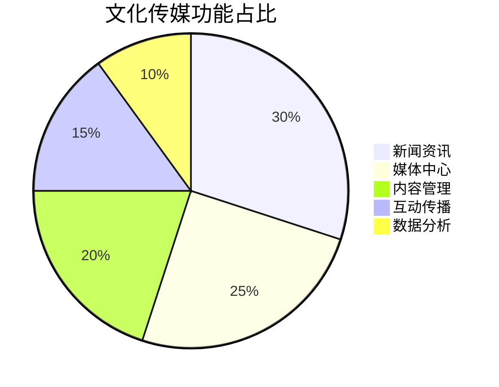

### 房产建筑功能分布


### 制造工业功能分布
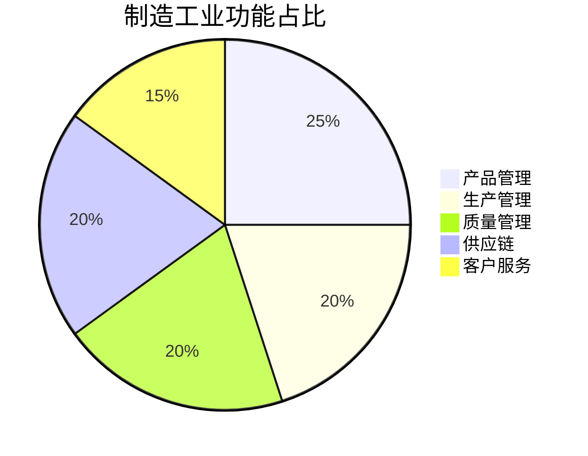

### 物流运输功能分布


### 农业生产功能分布
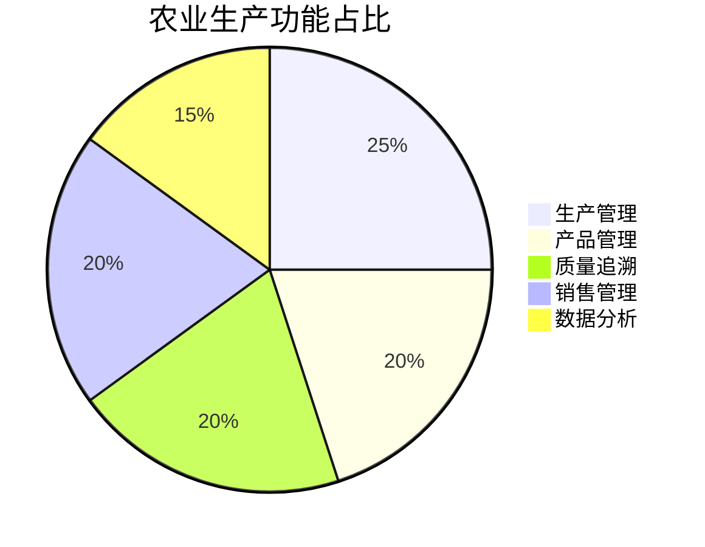

### 旅游服务功能分布
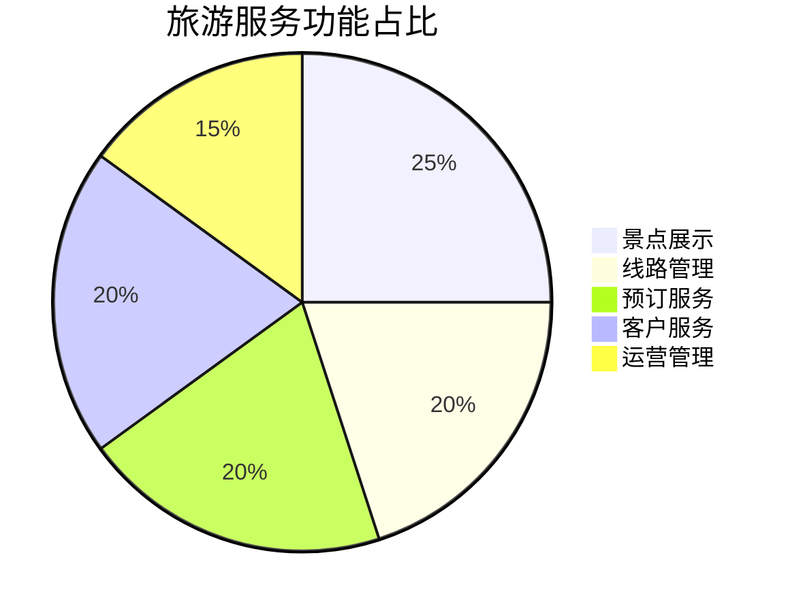

### 能源环保功能分布


### 餐饮服务功能分布


### 美容健身功能分布
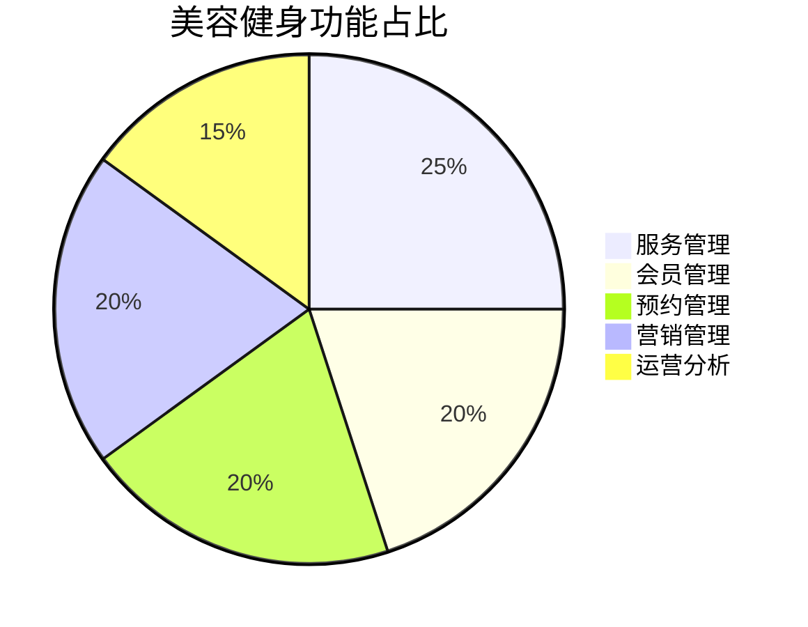

### 汽车服务功能分布


### IT科技功能分布
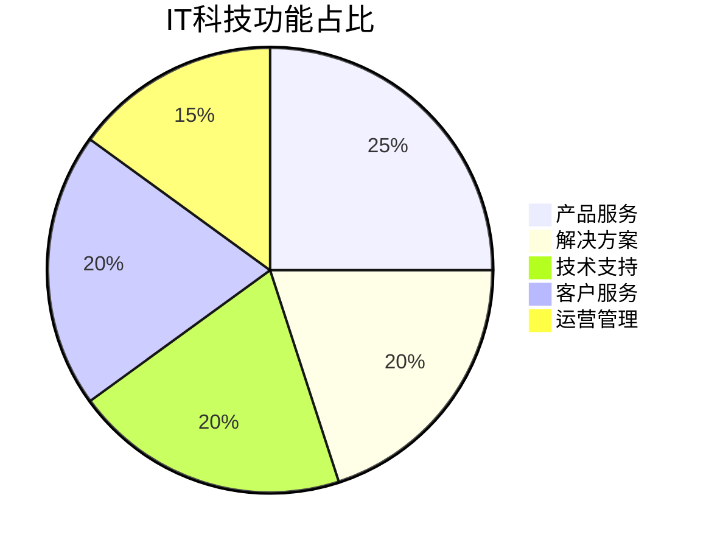

## 📚 文档结构

项目文档采用以下结构：

- `README.md`（当前文件）- 项目概览和快速入门
- `docs/` - 详细技术文档
  - `README.md` - 文档索引
  - `industries/` - 行业模板文档
    - `enterprise.md` - 企业门户
    - `training.md` - 教育培训
    - `hospital.md` - 医疗门户
    // ... 其他行业文档

## 📚 支持的行业模板

> 详细文档请访问 [docs/](docs/)

- [企业门户](docs/README-Enterprise.md) - 适用于集团企业、制造企业、科技企业等
- [教育培训](docs/README-Education.md) - 适用于培训机构、在线教育、职业培训等
- [医疗健康](docs/README-Hospital.md) - 适用于医院、诊所、健康机构等
- [政府机构](docs/README-Government.md) - 适用于政府部门、事业单位等
- [商贸服务](docs/README-Trade.md) - 适用于进出口贸易、批发零售等
- [零售门户](docs/README-Retail.md) - 适用于零售连锁、商超百货等
- [金融服务](docs/README-Finance.md) - 适用于银行、保险、证券等
- [文化传媒](docs/README-Media.md) - 适用于新闻媒体、文化传播等
- [房地产门户](docs/README-RealEstate.md) - 适用于房地产开发、物业管理等
- [建筑门户](docs/README-Construction.md) - 适用于建筑工程、装饰装修等
- [家装门户](docs/README-HomeDecoration.md) - 适用于家装公司、装修平台等
- [制造门户](docs/README-Manufacturing.md) - 适用于制造业、工业企业等
- [物流门户](docs/README-Logistics.md) - 适用于物流公司、快递企业等
- [农业门户](docs/README-Agriculture.md) - 适用于农业企业、农产品等
- [旅游门户](docs/README-Tourism.md) - 适用于旅游公司、景区景点等
- [能源门户](docs/README-Energy.md) - 适用于能源企业、电力企业等
- [环保门户](docs/README-Environmental.md) - 适用于环保企业、环境服务等
- [餐饮门户](docs/README-Catering.md) - 适用于餐饮企业、连锁餐饮等
- [美容门户](docs/README-Beauty.md) - 适用于美容院、美发店等
- [健身门户](docs/README-Fitness.md) - 适用于健身房、运动中心等
- [汽车门户](docs/README-Automotive.md) - 适用于4S店、汽车服务等
- [IT门户](docs/README-IT.md) - 适用于IT企业、软件公司等

## 🚀 快速开始

### 环境要求
```bash
Node.js >= 16
PostgreSQL >= 10
Redis >= 6
```

### 安装步骤
1. 选择行业模板
```bash
npx create-strapi-app my-site --template [industry]
```

2. 安装依赖
```bash
cd my-site
yarn install
```

3. 启动服务
```bash
yarn develop
```

## 📦 目录结构
```
├── docs/                # 行业模板文档
│   ├── README-Enterprise.md    # 企业门户
│   ├── README-Education.md     # 教育培训
│   ├── README-Hospital.md      # 医疗门户
│   └── ...                     # 其他行业模板
├── src/                 # 源代码
├── config/              # 配置文件
├── public/              # 静态资源
└── README.md            # 项目说明
```

## 🔧 配置说明

详细配置说明请参考各行业模板文档。

## 📄 许可证

MIT License

## 🆘 技术支持

- 安装部署支持
- 功能定制开发
- 系统集成服务
- 运维托管服务
- 培训指导服务

# 项目名称

简短项目描述

## 快速开始

基本安装和使用说明

## 详细文档

详细文档请查看 [docs/](docs/README.md) 